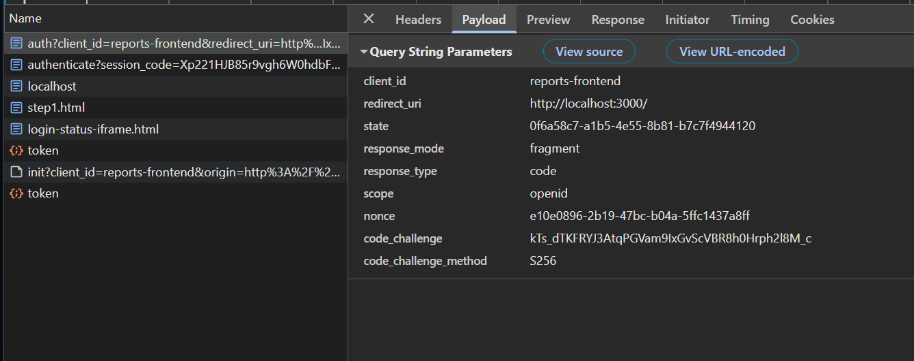
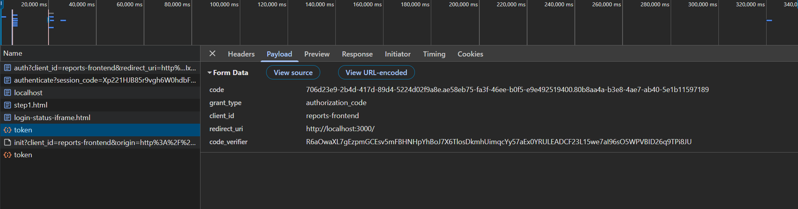

# Задача 1. Предложите архитектурное решение и доработайте диаграмму C4 для управления учётными данными пользователя.

> Унификацию доступа в системе BionicPRO. Это будет осуществляться через запрос данных учётных записей из внешнего источника, который расположен в стране представительства компании. Принципы локального хранения персональной и медицинской информации не должны быть нарушены.

- Выделен Keycloak в границах основной системы в роли Identity provider federation
- Каждый регион поддерживает свой IDP со своей БД пользователей предоставляя сервису только нужные для работы данные

> Безопасную схему работы с access- и refresh-токенами, которая исключает передачу фронтенду токенов, которые были получены от IdP.

- Выделен backend for frontend который инкапсулирует взаимодействие с IDP и сервисом API
- После успешной авторизации BFF отправляет в браузер пользователя http only cookie которая ассоциирована с данными авторизации 
- Браузер при взаимодействии с BFF отправляет cookie???! , всё взаимодействие с сервисами осуществляется  

> Возможность поддержки аутентификации пользователей через различные внешние удостоверяющие службы, действующие в разных странах.

Это сделано на шаге один. К региональному Keycloak можно подключать сторонние IDP.

# Задача 2. Улучшите безопасность существующего приложения, заменив Code Grant на PKCE.
PKCE включается указанием явного метода шифрование в Keycloak и в конфигурации приложения.

Проверил что в запросе присутствует code_challenge и code_challenge_method

В ответе code_verifier

